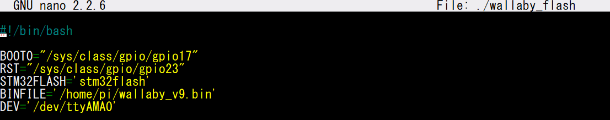

# How to setup the MPU9250 (gyroscope/accelerometer)
## Step 1 - Copy File
Copy the provided .bin file to the wombat.
To do this, run `scp ./wombat.bin pi@192.168.125.1:~/wallaby_v9.bin`
from the command line.
## Step 2 - Edit Script
You must edit `~/wallaby_flash` on the wombat. Change `BINFILE` to be
`/home/pi/wallaby_v9.bin` as seen in the photo.

Make sure to save the file after editing it.
## Step 3 -Run Script
This is the easy part. Run `sudo ~/wallaby_flash` on the wombat
and watch as it installs.
## Step 4 - Reboot and View Results
All should be good now. Reboot the wombat and check out if the
gyro is working as intended.